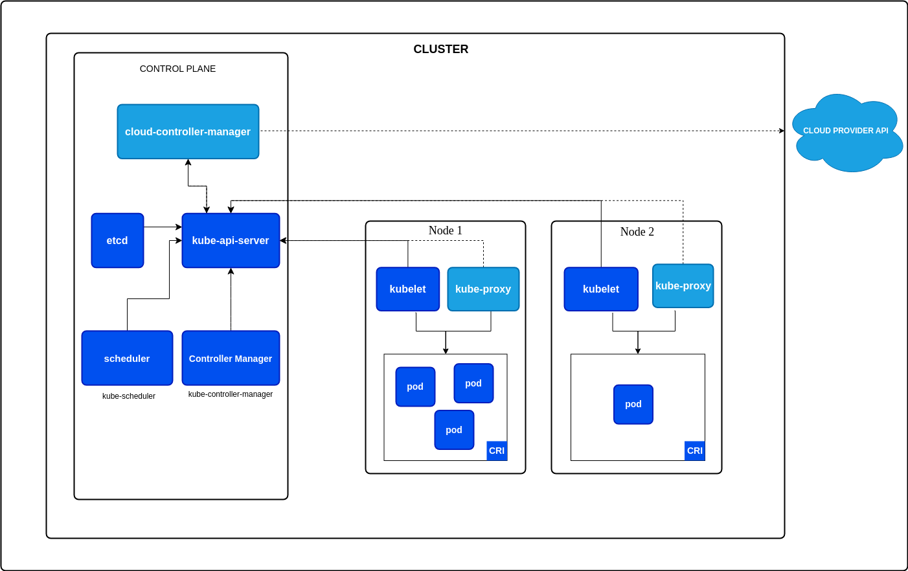

## **4. Cluster Architecture, Installation & Configuration (25%)**

> **Objetivo:** Dominar a configuração, instalação e gerenciamento de clusters Kubernetes, com foco em alta disponibilidade, atualização, configuração do `kubeconfig`, backup e restauração de dados críticos.

---

### **4.1 Arquitetura do Cluster**



#### **Componentes do Control Plane**
O Control Plane é responsável por gerenciar o estado desejado do cluster. Ele inclui os seguintes componentes principais:  

1. **kube-apiserver**:  
   - Interface REST que gerencia as interações entre os usuários e o cluster.
   - Valida solicitações e as encaminha para os demais componentes.  

2. **etcd**:  
   - Banco de dados chave-valor distribuído que armazena os dados de configuração e o estado atual do cluster.  
   - É essencial para a recuperação de estado em caso de falha.

3. **kube-scheduler**:  
   - Responsável por atribuir Pods a Nodes disponíveis, considerando recursos, políticas e afinidade.

4. **kube-controller-manager**:  
   - Executa diversos controladores, incluindo:
     - **Node Controller**: Monitora o estado dos nodes.
     - **Replication Controller**: Garante que o número desejado de réplicas de um Pod esteja em execução.

5. **cloud-controller-manager** (opcional):  
   - Gerencia interações com provedores de nuvem, como criação de Load Balancers ou discos.

---

#### **Componentes do Node**
Os Nodes executam as aplicações e suportam as operações definidas pelo Control Plane.  

1. **kubelet**:  
   - Interage com o kube-apiserver para garantir que os contêineres estejam de acordo com os manifests enviados.  

2. **kube-proxy**:  
   - Gerencia as regras de rede do cluster e direciona o tráfego entre os Pods e os serviços.  

3. **Container Runtime**:  
   - Responsável por executar os contêineres, exemplos incluem `containerd`, `CRI-O` e `Docker` (depreciado).  

---

### **4.2 Instalação de Clusters com `kubeadm`**

O `kubeadm` é uma ferramenta oficial para criar clusters Kubernetes rapidamente.

#### **Passo a Passo: Instalação de um Cluster**

1. **Instalar dependências:**
   ```bash
   sudo apt update
   sudo apt install -y apt-transport-https curl
   ```

2. **Adicionar os repositórios Kubernetes:**
   ```bash
   curl -s https://packages.cloud.google.com/apt/doc/apt-key.gpg | sudo apt-key add -
   echo "deb https://apt.kubernetes.io/ kubernetes-xenial main" | sudo tee /etc/apt/sources.list.d/kubernetes.list
   sudo apt update
   ```

3. **Instalar kubeadm, kubelet e kubectl:**
   ```bash
   sudo apt install -y kubelet kubeadm kubectl
   sudo apt-mark hold kubelet kubeadm kubectl
   ```

4. **Inicializar o Control Plane no Master Node:**
   ```bash
   sudo kubeadm init --pod-network-cidr=192.168.0.0/16
   ```

5. **Configurar o acesso ao cluster:**
   ```bash
   mkdir -p $HOME/.kube
   sudo cp -i /etc/kubernetes/admin.conf $HOME/.kube/config
   sudo chown $(id -u):$(id -g) $HOME/.kube/config
   ```

6. **Instalar um plugin de rede (exemplo: Calico):**
   ```bash
   kubectl apply -f https://docs.projectcalico.org/v3.14/manifests/calico.yaml
   ```

7. **Adicionar Nodes ao cluster:**
   - Execute o comando `kubeadm join` exibido após a inicialização do Master Node em cada Node Worker.

---

### **4.3 Configuração do `kubeconfig` para Múltiplos Clusters**

O `kubeconfig` permite gerenciar múltiplos clusters Kubernetes.

#### **Exemplo: Adicionar outro cluster ao `kubeconfig`:**
```bash
kubectl config set-cluster my-cluster --server=https://my-cluster-endpoint:6443 --certificate-authority=/path/to/ca.crt
kubectl config set-credentials my-user --client-certificate=/path/to/client.crt --client-key=/path/to/client.key
kubectl config set-context my-context --cluster=my-cluster --user=my-user
kubectl config use-context my-context
```

---

### **4.4 Atualização do Cluster**

As atualizações do Kubernetes são gerenciadas via `kubeadm`.

#### **Passos para Atualizar um Cluster:**
1. Atualizar pacotes no Master Node:
   ```bash
   sudo apt update && sudo apt upgrade kubeadm
   ```

2. Atualizar o Control Plane:
   ```bash
   sudo kubeadm upgrade plan
   sudo kubeadm upgrade apply v1.xx.x
   ```

3. Atualizar os Nodes:
   ```bash
   sudo apt update && sudo apt upgrade kubelet
   sudo systemctl restart kubelet
   ```

---

### **4.5 Alta Disponibilidade (HA)**

#### **Configuração de HA com etcd Externo**
1. Configure um cluster etcd externo.  
2. Use o argumento `--external-etcd-endpoints` ao inicializar o Control Plane com `kubeadm`.

#### **Configuração com Load Balancer Interno**
Adicione um Load Balancer na frente de múltiplos nós do Control Plane para distribuir solicitações.

---

### **4.6 Backup e Restauração do etcd**

#### **Backup do etcd**
```bash
ETCDCTL_API=3 etcdctl snapshot save snapshot.db \
  --endpoints=https://127.0.0.1:2379 \
  --cacert=/etc/kubernetes/pki/etcd/ca.crt \
  --cert=/etc/kubernetes/pki/etcd/server.crt \
  --key=/etc/kubernetes/pki/etcd/server.key
```

#### **Restauração do etcd**
```bash
ETCDCTL_API=3 etcdctl snapshot restore snapshot.db \
  --data-dir /var/lib/etcd-new
```
