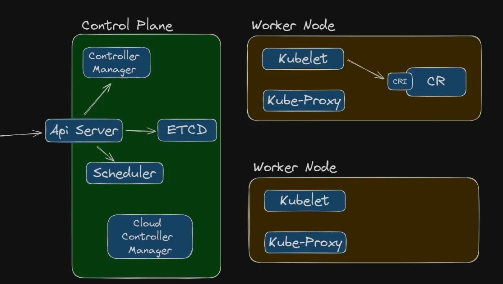

### **2. Cluster Architecture, Installation & Configuration (25%)**

---

O Kubernetes é composto por uma arquitetura modular que garante sua robustez e flexibilidade. Nesta seção, exploraremos os componentes principais do cluster, instalação com `kubeadm`, configuração, atualizações, alta disponibilidade, gerenciamento de runtime e backups essenciais.

---

#### **2.1 Componentes do Control Plane e do Worker Node**

O Kubernetes divide sua arquitetura em dois conjuntos de componentes principais:

##### **Control Plane**
O Control Plane gerencia o estado desejado do cluster, garantindo que as cargas de trabalho estejam funcionando conforme esperado.

- **kube-apiserver**:  
  - Interface principal para comunicação com o cluster.
  - Exposto via API RESTful.
  - Valida e processa solicitações de objetos do Kubernetes.

**NOTA**: Ao executar um comando 'kubectl', você se comunica diretamente com o API SERVER.

- **kube-scheduler**:
  - Responsável por atribuir Pods aos Nodes disponíveis.
  - Considera fatores como afinidade de Node, capacidade e políticas de tolerância.

**NOTA**: O SCHEDULER recebe os elementos que devem ser criados no kubernetes pelo API SERVER, elegendo onde será executado ou seja, em qual WORKER NODE será executado.

- **etcd**:  
  - Banco de dados chave-valor distribuído.
  - Armazena o estado do cluster.
  - Alta disponibilidade é crucial para integridade dos dados.

**NOTA**: Todas as informações de onde será executado cada objeto ou cada informação de configuração de cada objeto precisam estar armazenados em algum lugar e é aqui que entra o ETCD como um objeto de persistencia de dados para essas finalidades. Inclusive se você quiser fazer um backup do seu cluster kubernetes para restaurar em outro cluster, o objeto de backup para isso é o ETCD.
Tenha em mente que você não irá acessar as informações do ETCD diretamente, você sempre irá utilizar o API SERVER para consultar alguma informação no kubernetes.

- **kube-controller-manager**:
  - Executa processos de controle, como:
    - **Node Controller:** Gerencia o status dos Nodes.
    - **Replication Controller:** Garante o número desejado de réplicas.
    - **Endpoints Controller:** Liga Pods aos Services.

**NOTA**: O CONTROLLER MANAGER é responsável por gerenciar os controladores do kubernetes.

O kubernetes é extremamente flexível, sendo possível execução de aplicações, soluções de arquitetura como observabilidade, api gateway e outros diversos objetos de infraestrutura como codigo através do crossplane por exemplo, onde é possível trabalhar com gerenciamento de infraestrutura no kubernetes e isso acontece porque o kubernetes trabalha baseado em diversos parametros chamados de RECURSOS ou RESOURCES e cada controlador é responsável por uma área ou setor onde é verificado esses parametros, valores ou recursos no kubernetes e caso esses valores sejam alterados, uma decisão é tomada.

Como exemplo prático, podemos usar o REPLICASET. Ele é um controlador que verifica a quantidadede réplicas dos pods e caso seja definido que 3 réplicas sejam executadas, ele irá fazer com que o valor seja igual a 3.

Outro exemplo é o NODE CONTROLLER. Ele gerencia os nós do cluster kubernetes, por exemplo, se um nó cair, ele verifica e toma uma ação como restabelecer esse nó criando um novo, fazendo um rescheduller dos pods, fazendo também que os containers sejam executados em outro lugar, etc...e é o CONTROLLER MANAGER que gerencia todos esses controladores.

- **cloud-controller-manager** (opcional):
  - Gerencia a integração com provedores de nuvem, como AWS ou GCP.
  
**NOTA**: Em cloud, quando se cria um serviço com IP publico, o CLOUD CONTROLLER MANAGER gerenciará isso.

##### **Worker Node Components (Componentes dos Nós)**

Os Nodes executam as cargas de trabalho e reportam seu estado ao Control Plane.
Uma analogia interessante é comparar com uma orquestra simfonica onde o Control Plane é o maestro e os Worker Nodes são os musicos.

- **kubelet**:
  - Componente principal no Node.
  - Garante que os contêineres estejam rodando conforme especificado nos manifestos.
  
**NOTA**: Responsável pela comunicação do kubernetes com o container runtime.

- **kube-proxy**:
  - Gerencia as regras de rede.
  - Suporta conectividade de rede entre Pods e Services.
  
**NOTA**: Responsável por realizar toda a comunicação de rede entre os objetos do cluster kubernetes.

- **Container Runtime**:
  - Executa contêineres.
  - Exemplos: **containerd**, **CRI-O**, ou Docker (legacy).

**PS**: O KUBE SCHEDULLER define em qual worker node o container será executado, o KUBELET irá receber essa requisição e irá se comunicar com o CONTAINER RUNTIME do worker node eleito pelo scheduller. O KUBELET se utiliza de uma interface de comunicação como o CRI por exemplo para interagir com o container runtime e executar o container. Além disso, ele irá sempre verificar a saúde daquele container e notificará o API SERVER.

Graças ao uso de interfaces de comunicação com o container runtime, hoje podemos usar o containerd, o CRI-O, etc...fazendo o kubelet se comunicar com o container runtime com muito mais flexibilidade.

Mas e o DOCKER?
O docker foi por muito tempo o container runtime do kubernetes de forma nativa e quando surgiu essas opçṍes de interface, essa integração foi desfeita pois o docker não implementa o CONTAINER RUNTIME INTERFACE. Antigamente existia um projeto que fazia a tradução do docker com o cri mas foi descontinuado e parou de ter essa compatibilidade. Mas o dockerd, tem o containerd, então qualquer imagem criada com o docker, será compativel com kubernetes.

##### **CNI - Container Network Interface**
Este objeto fará a comunicação com a ferramenta que fará o gerenciamento de rede de containers no kubernetes. Ele que irá provisionar ip pros pods por exemplo.
No mercado temos alguns, como por exemplo:
- WaveNet
- Calico
- Flannel

##### **CSI - Container Storage Interface**
Interface que fará com que o kubernetes se comunique com ferramentas de storage em cloud providers como AWS, GOOGLE, AZURE, OCI, etc... ou ambientes on-premises usando por exemplo o Longhorn da rancher.

